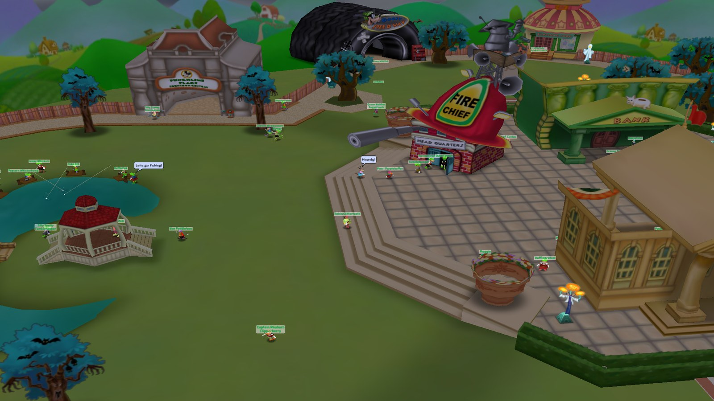
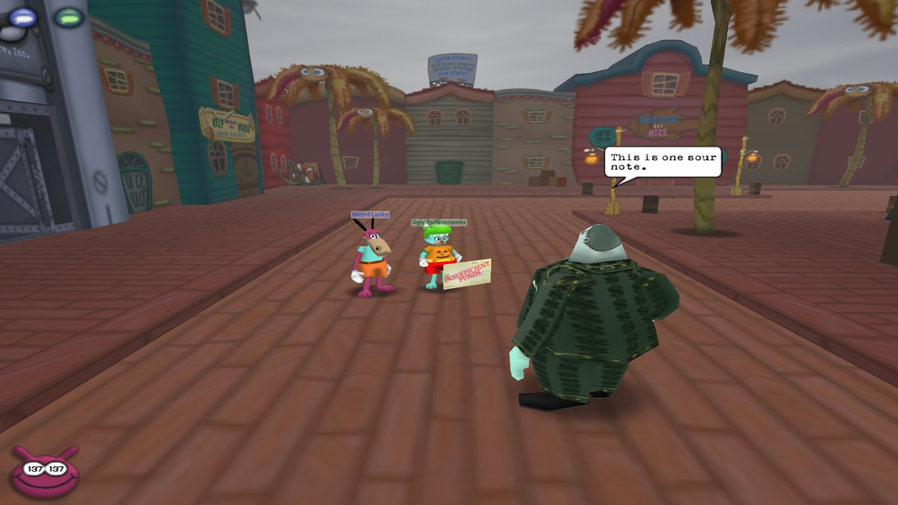
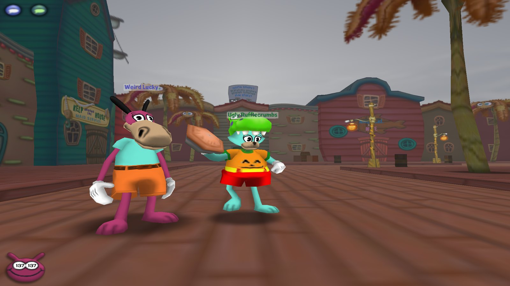
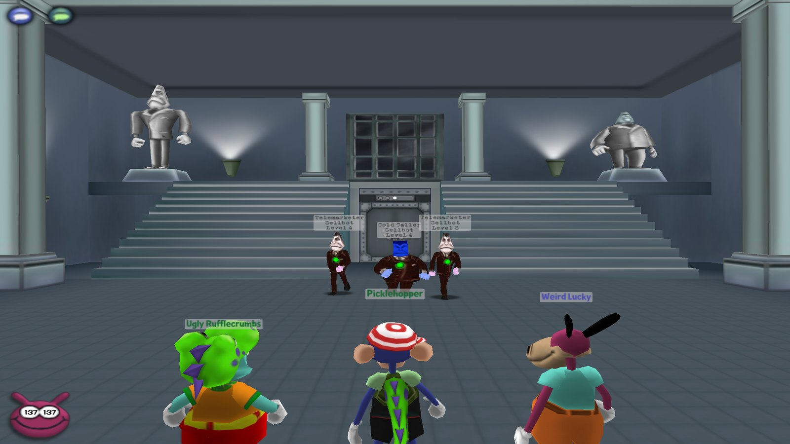
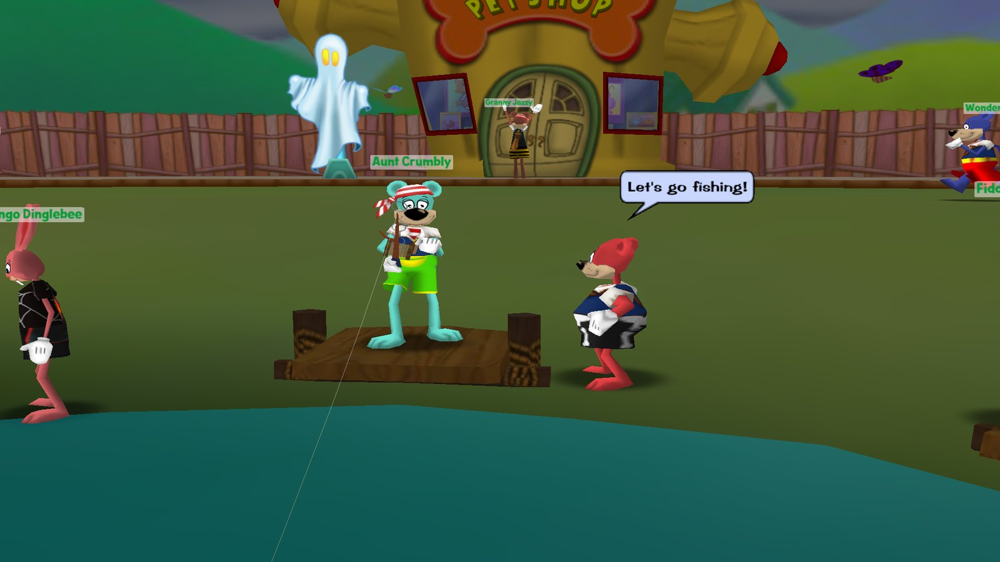
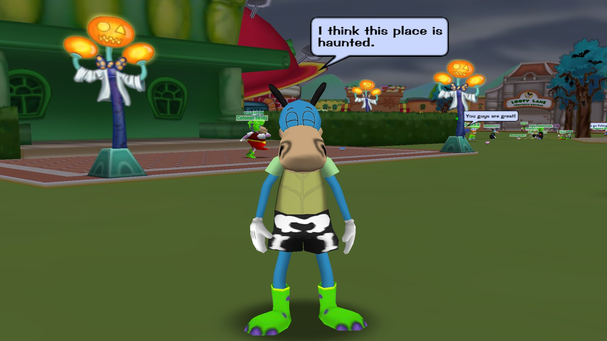
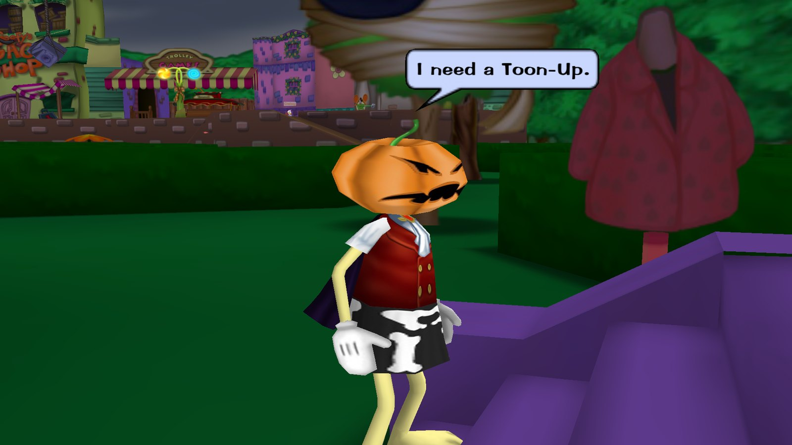

# Toontown Classic with Bots

Toontown Online as it played at its September 2013 shutdown, on your own PC, with a town full of bot toons that play
like real players. About 420 bots start as fresh level-1 toons and level up by playing: they work their own
ToonTasks, fight Cogs as a team, take back Cog buildings, run factories and boss battles with you, fish, ride the
trolley and play every trolley game, dress up for Halloween, and answer the game's own SpeedChat ("Follow me.",
"Can you help me?", "Help!"). Under the bots is [Open Toontown](https://github.com/open-toontown/open-toontown) (the
open-source Toontown client and server) plus my crash fixes and the server pieces that were still missing (estates,
parties, fishing, the catalog, holidays). It is a non-commercial fan project for playing at home with family or friends.

**Status:** playable; my family plays it on a home server with about 420 bots. Bot levelling is new (2026-09-30) and
still being play-tested; bot features not yet seen on the live server are marked below. The install steps follow the
repo's own scripts but have not been re-tested on a fresh PC. · **Visibility:** public · **Last updated:** 2026-10-04

## Screenshots

*Toontown Central in October: the toons here are bots, fishing at the pond, chatting and heading off to play.*

| | |
|---|---|
|  |  |
| A bot joins your street battle on its own (the Cog is aiming at the bot). | Bots pick and throw their own gags. |
|  |  |
| Two bots took a three-floor Cog building with a player, floor by floor. | Bots fish, and chat with the game's own SpeedChat. |
|  |  |
| In October the bots dress up and add the Halloween SpeedChat lines. | A pumpkin head from the Trick-or-Treat hunt, and a bot asking for a Toon-Up. |

All shots are from the game itself (a test copy of my server, Halloween event on). The bots shown were all logged
in and acting on their own; my test toon is the one with the blue name.

## Contents
- [Screenshots](#screenshots)
- [Bot features](#bot-features)
- [Game features](#game-features)
- [Requirements](#requirements)
- [Install](#install)
- [Run / Play](#run--play)
- [Bot settings](#bot-settings)
- [Configuration](#configuration)
- [How it works](#how-it-works)
- [Project layout](#project-layout)
- [Development](#development)
- [Changes from Open Toontown](#changes-from-open-toontown)
- [Coming soon](#coming-soon)
- [Recent changes](#recent-changes)
- [Related repositories](#related-repositories)
- [Credits and license](#credits-and-license)

## Bot features
All of this is in `toontown/bots/` and runs on my server today, unless an item says otherwise. A bot does everything
with the same messages a game client sends, so the game's own server rules (prices, laff, carry limits, elevator
checks, ToonTask rules, fishing catches) apply to bots exactly as they apply to you. The only things written straight
into the database are a bot's starting toon, the Cog HQ crew's Cog suits and gags, and Halloween costumes.

### Who the bots are
- **Real toons.** Each bot is a toon in the game database on its own bot account, logged in by the server with no game
  window. It has a 2013 Pick-A-Name name and a random look fixed by its number, so it is the same toon every time it
  logs in.
- **Click one like any toon.** Its toon panel and Details show its real laff, gags and location. Ask it to be friends
  and it says yes; whisper to it and it answers in SpeedChat; it shows online in your friends list and you can
  teleport to it.
- **A personality each, kept for good.** About 1 in 10 are grinders who log in first and almost always work on their
  ToonTasks, 6 in 10 are regulars who mostly do, and 3 in 10 are casual players who mostly just play. Each one has its
  own favourite gag tracks for when a track choice comes up.
- **How many.** By default 480 bot toons exist and up to 420 are online at once: the levelling toons plus a crew of 60
  high-level Cog HQ regulars (bots 301-360). Bot 1, Lucky Doodlesnout, always stays in Toontown Central.

### Life in town
- **Busy places, where you are.** Toontown Central's playground holds 34-50 toons, the other playgrounds 17-30, each
  street 4-10 and each Cog HQ place 2-5, counted as toons a player there would actually see. On your street 9-13 toons
  are in view. The area you are in, or are loading into, and the areas next to it fill first.
- **Coming and going like toons.** Where you can see them, bots arrive and leave through the teleport hole, a tunnel or
  a building door; where nobody can see, they move silently. Over time the same regulars move between their home
  playground, its streets and the shared places (Chip 'n Dale's Acorn Acres, Goofy Speedway, Chip 'n Dale's MiniGolf),
  log out and come back later.
- **Walking.** Bots walk on maps baked from the game's own collision models, so they never walk through walls, into
  water or off ledges. They mostly run like players and sometimes stroll. Their movement is sent with client-style
  timestamps so it looks smooth on your screen, with no rubber-banding.
- **Playgrounds.** They hang out in loose groups at landmarks (fountain, gazebo, trolley, gag shop, Toon HQ and so on),
  turn to each other, wander with natural pauses, greet or wave at toons they pass and use emotes. No random jumping:
  never a jump, Belly Flop or Banana Peel.
- **Personal space.** Wherever they stop (a group at a landmark, a shop or building door, the trolley, a fishing pond,
  a facility or boss elevator, near a battle they are not in) they keep about 2.5 ft from every other toon. They never
  stand on a door's way-out spot or next to a fishing seat, come out of a door one at a time, and where a player is, a
  bot that finds someone standing inside it steps aside. They still walk past each other, as toons do.
- **Shops and buildings through the real doors.** The gag shop (buying gags from the clerk), Toon HQ (talking to the
  officers), the clothes shop, pet shop, bank, library, school and Toon Hall. Only a few bots go into one shop at a
  time.
- **Streets.** They walk the sidewalks from building to building and tunnel to tunnel, like a player doing ToonTasks,
  step into toon buildings and talk to the shopkeepers, and keep clear of walking Cogs (they wait or step aside).
- **Near a battle they act like players, not spectators.** A battle takes only its free spots in helpers. Every other
  bot nearby starts its own fight, heads for a Cog building, runs around the battle or turns back. None of them stands
  and stares.

### Chat
- **2013 SpeedChat only.** Bots never type. Each zone has a chat budget, so only a few toons talk at once.
- **They talk to each other.** A question from one bot gets an answer from a toon standing near it.
- **They answer you.** Say something near a bot and it turns to you and answers; greet it and it may wave back. Ask
  "What ToonTask are you working on?" and it answers with its real task from the ToonTask menu.
- **They say what a player would say about what they are doing:** "I need more gags.", "I need more jellybeans.",
  "I need more Laff points.", "I need a Toon-Up.", "I need to get a ToonTask.", "Can you help me?", "Let's go take over
  a Cog building!", "Let's go in the elevator!", "Let's go in the Factory!", lines that fit the place they stand in, and
  their own ToonTask line.
- **Making friends:** "Please be my friend!" from one bot, "Yes" from the other.

### Your commands (the game's own SpeedChat)
Say these out loud near bots, or whisper them to one bot (a friend or not):
- **"Follow me."** The nearest free bot (sometimes 2, at most 3) says OK and follows you everywhere, with a natural
  gap: through the tunnel you took, in and out of building doors, onto the trolley and into its minigames (it makes
  your Play Again or Exit choice), into your street battles, into the Cog building or Cog HQ elevator you board, and
  to you when you teleport. Whisper it to a bot friend in another place and it teleports to you.
- **"Wait here." / "Stay."** It stands still until you say "Follow me." again, "Bye!", or 3 minutes pass.
- **"Bye!"** Your bots go back to their own lives.
- **ToonTask lines.** Your ToonTask from the SpeedChat ToonTask menu, or "Let's work on that.", "I'm going to look for
  that.", "I haven't found it yet.", "Can you help me?" or "I need help with the Cogs!": one or two bots come and help
  with that task. They read your task the way your Shticker Book shows it, join your battles, and on a street walk up
  to a Cog your task counts and start the battle for you to join.
- **"Let's go ..." lines.** The trolley, fight the Cogs, back to the playground, or a playground by name: the bots
  following you go there with you.

### Asking for and giving help
- **Calling for help.** A bot that gets into trouble in a street battle says "Help!" or "We are in trouble.", and the
  nearest free bots on that street run over and join, a Toon-Up carrier first when someone is hurt.
- **Answering anyone's call.** When anyone, you included, says "Help!", "We are in trouble." or "I need help with the
  Cogs!", or types a line with "help" in it, in a street battle with a free spot, free bots come running ("Bring it
  on!", "We can do this!", "Hurry!").
- **Teaming up on ToonTasks.** A new toon whose task Cog is too tough to beat alone starts the fight and asks "Can you
  help me?"; free toons join, the ones who need the same Cog first, and every toon in the fight gets credit for it.
- **Waiting outside for a group.** A bot with a Cog building task waits at the building's door asking for help, and
  help can come from anywhere in that neighborhood; toons who need the same building team up. A bot with a factory
  task waits at the factory elevator asking ("Let's go in the Factory!") and goes in with a party of 4.
  The building and factory waits were proven on a test copy of the server; the live bots have not reached those tasks
  yet.

### Battles
- **Starting and joining.** On a street a bot walks into a Cog to start a battle, or runs over and joins one that is
  already going (up to 4 toons), like a player. After the battle it heads back to the playground when low on laff, and
  teleports there when it goes sad.
- **Only fights it can handle.** Before starting a fight alone, a bot checks the Cog's laff and damage (from the game's
  own tables) against its own gags and laff, and leaves too-tough Cogs alone or gets help (see above).
- **One shared battle brain for every fight:** streets, Cog buildings, factories, mints, DA offices, Cog Golf Courses
  and boss rounds. It plays every battle step the way the game client does and "thinks" a few seconds before each pick.
- **You pick first.** Bots wait for your pick until just before the timer, then pick one at a time, each seeing every
  pick already made that round.
- **Backing you up.** Your Trap: exactly one bot lures that Cog. Your Sound: the bots use Sound too. Anything else: the
  same track on your target.
- **No wasted or clashing gags.** Never two lures on one Cog or a lure while someone is already luring, no Sound in a
  round with a lure (Sound wakes lured Cogs), no Drop on a lured Cog, no Trap where a Trap already is, and no lure
  when nobody in the battle can hit the lured Cog.
- **Exact damage.** A bot adds up the damage already picked for each Cog (track combo bonus, lure knock-back, a Trap
  springing) with the game's own gag damage, then picks the gag that finishes a Cog with the least overkill. No
  level-1 Squirt on a level-12 Cog unless it finishes it.
- **Healing.** One healer unless one heal is not enough, counting heals already picked; a group Toon-Up when several
  toons are at risk; nobody heals when the heals already picked bring everyone up.
- **Keeping the team alive.** Each round a bot estimates the damage coming. When someone could go sad, it heals or
  makes the play that leaves the fewest dangerous Cogs able to attack (a lure, Sound over every Cog, a kill on a
  different Cog), and uses its big gags then instead of saving them.
- **Gags run low like a player's.** A bot can run out mid-fight on a street. It never passes as the first picker and
  passes only when every Cog goes down anyway; it says "I need more gags." and refills at the gag shop with its own
  jellybeans.
- **Running away.** Only from a losing street battle, and only after calling for help. Never when a real player is in
  the battle, and never in Cog buildings, Cog HQ facilities or boss battles.

### Cog buildings, Cog HQ and bosses
- **Gag check first.** Before a Cog building, factory, mint, DA office, Cog Golf Course or boss battle, a bot heals up
  and fills its gag pouch (at least 80% of what it can carry), like a player getting ready.
- **Cog buildings.** A bot leader picks a building on its street, calls 1-3 bots who run over, waits at the door until
  they are there, and they all board the elevator. When you board a Cog building elevator on your street, bots run
  over and fill the seats. They fight every floor, ride the elevator between floors and take the building back.
- **Cog HQ facilities.** Groups run Sellbot factories (front and side entrance), Cashbot mints, Lawbot DA offices and
  Bossbot Cog Golf Courses, including the golf course games: the mole field (at a kid's reaction time, never a bomb
  on purpose), the golf green puzzles and the maze.
- **Someone is always waiting.** A few ready toons stand at every facility elevator (the factory entrances, the three
  mints, the four DA offices, the three golf carts), so you always find a group. When you sit down, 1-3 of them come
  along; when bots filled a car on their own, one steps off for you (never a real toon).
- **Inside with you.** In a facility with a real player, bots never lead: they follow your trail, join every battle
  you are in and take the floor elevator when you do.
- **Boss lobbies.** 8 ready toons always wait at each boss elevator (VP, CFO, CJ, CEO). Sit down and 7 bots board with
  you at once; every other real toon who walks up takes a bot's seat; the fight always starts with 8 toons. Bots never
  ride a boss elevator without a real toon.
- **Each boss's own final round:**
  - VP: grab pies at the cage, throw them into the open hatch while the gears fly to make the boss dizzy, then pie the
    dizzy boss; now and then a pie heals a teammate who looks sad.
  - CFO: each bot takes a free crane, swings goons into the boss and drops safes on it while it is dizzy (and knocks
    off its helmet); bots without a crane stomp goons and pick up the treasure.
  - CJ: each bot takes its own cannon and aims for the empty juror chairs, then carries evidence from the witness
    stand to the scale and stuns the lawyers now and then.
  - CEO: serve food from the belts to the hungry diners, fight the diner battles, then squirt the boss from the banquet
    tables and hit it with golf balls (a free table and golf spot are kept for every real toon).
  All four finales were tested with bots only and with a game client.
- **The Cog HQ crew.** Bots 301-360 never reset. They have believable Cog suits (a spread of suit levels, merits
  banked, some ready for promotion) and carry a maxed player's gags, and they keep the boss lobbies and facility
  elevators busy until the levelling bots catch up. From then on the game treats their suits like yours: factories
  give parts and merits, boss battles promote.

### Levelling up like a player
- **Everyone starts at level 1.** Every bot except the crew starts as a fresh toon (15 laff, Throw and Squirt, a
  40-jellybean jar, Toontown Central only) and gets better only by playing.
- **Its own ToonTasks.** A bot reads its tasks the way you read your Shticker Book and works on them: defeat Cogs,
  take back Cog buildings, factory and Cog suit tasks, trolley tasks, fishing items out of a pond, visiting and
  delivering to shopkeepers (it walks into their building and talks to them), buying gags for a Deliver task, using
  the phone or mailbox at its own estate, and making a friend (bots send each other real friend requests). If a task
  shopkeeper's building has been taken by the Cogs, it takes the building back first.
- **New tasks and choices.** It gets tasks from the Toon HQ officers and picks from their offers like a player (the
  easiest one; a grinder the quickest), and picks its new gag tracks.
- **Jellybeans and gags.** It earns jellybeans on the trolley and by fishing, buys its own gags, and earns gag
  experience in battle. Level-ups bring more laff, new tracks, a bigger pouch and jar, and teleport access, and it
  moves on to the next playground when it has earned it.
- **At a player's pace, only when you play.** Bots make progress only while a real player is logged in (after 10
  seconds online). Two minutes after the last player leaves they stop starting new progress; they stay online and
  just hang out.
- **Never stuck in a loop.** A goal that keeps failing to start is set aside for a while.
- **Not yet seen live:** the later tasks. Donald's Dock, Daisy Gardens and Minnie's Melodyland tasks (buildings,
  factories, the foreman, Skelecogs) passed on a test copy of the server; the live bots are still on Toontown
  Central tasks, and Cog HQ and boss tasks have not been reached anywhere yet.

### Fishing, the trolley, shops and estates
- **Fishing** on every pond: the 6 playgrounds and 17 streets, 4 spots each. A bot casts (which costs jellybeans like
  yours), aims at the bubbles with a player's error and checks for a catch exactly when the game client would, so it
  only catches what a real cast could. It sells its bucket to the Fisherman when the bucket is full or it is out of
  beans. It never takes a pond's last free spot, and when you are waiting at a full pond one bot gets up for you.
- **The trolley.** Bots walk up and board while it waits, leave a seat free while a real player is close by, and the
  last bot to board hops off when you walk up to a full trolley. On the purchase screen they browse and buy gags,
  then pick Play Again or Exit.
- **Every trolley game has a bot brain:** Race Game, Cannon Game, Tag Game, Match Minnie, Ring Game, Maze Game,
  Tug-of-War, Catching Game, Treasure Dive, Toon Slingshot, Toon Memory Game, Jungle Vines, Ice Slide, Cog Thief,
  Toon Escape and Photo Fun, plus Trolley Tracks (the Thursday trolley-holiday board game). They play at a kid's pace
  and aim, and never stall or abort your game.
- **Gag shop.** Bots buy gags from the clerk with their own jellybeans; on a restock trip they fill up with their
  best gags first, like a player before heading out.
- **Estates.** For a phone or mailbox ToonTask a bot teleports home to its own estate (the game makes its estate and
  house on the first visit, as for a new player), walks through its house door, uses the phone (the catalog opens, it
  browses) or reads its mail, and teleports back to its playground.

### Halloween
- **Costumes.** While the Halloween decorations are up, most bots (about 85%) wear an outfit from the 2013 Halloween
  catalog: Halloween shirts, shorts and skirts, witch hats, Halloween glasses, backpacks and shoes, mixed. No
  jellybeans are spent, and each bot gets its own clothes back after the season.
- **Halloween chatter.** Now and then a bot says a line from the Halloween SpeedChat menu or one of the Halloween
  phrases, as extra chatter: everything else bots say stays the same, and the zone's chat budget still applies.
- **Trick-or-Treat.** Bots do the real hunt: they walk into the treat shops in the playgrounds they can reach, say
  "Trick or Treat!" and collect the jellybeans. Finding all six earns the pumpkin head; a bot that cannot reach every
  playground yet goes without. Not yet seen live: a bot finishing all six.
- **All October.** With `halloween-all-october #t` (see [Configuration](#configuration)) bots dress up for the whole
  month too.

### On the server
- **Its own process.** All bot thinking runs in a separate bot AI process on its own channel range, so it cannot slow
  the game's AI down; the game AI has no bot logic. Do not start the bot AI and the game runs with no bots.
- **Switches.** `want-bot-toons #f` turns bots off; the `bots.enabled` file turns them off and on while the server
  runs (bots leave a few at a time, the way toons do). Pool size, how many are online, and login and travel rates are
  settings. See [Bot settings](#bot-settings).
- **Status files** every few seconds: bots online, toons per area, real players seen, errors, levelling progress, every
  gag pick with its reason, and counters for battles, Cog HQ, playground life and player commands.
- **Built for a full town.** Tested with 420 bots online. Bots out of every player's sight send fewer position updates
  and no chat; logins after a restart clear leftover toons and retry with a back-off; database writes are throttled.
- **Test switches** in the run folder for sending a group on a facility or boss run, trying estate and friend trips,
  and sampling street life and movement (see [Bot settings](#bot-settings)).

### Tools (`toontown/bots/tools/`)
- `bake_walkmaps.py` bakes the walk maps from the game's collision models (a 3 ft grid of standable floor, minus water
  and walls).
- `check_walkmaps.py` replays random paths on each map against the real collision and counts wall, water and fall
  crossings (it fails on any).
- `bake_interiors.py` bakes the spots bots stand on inside shops and Toon HQs.
- `ttworld.py` loads a playground or street headlessly, the way the client does, for the two bake tools.

## Game features
- **The 2013 game.** Open Toontown's client and server for Toontown Online sv1.0.47.38: playgrounds, streets, Cog
  battles and Cog buildings, the trolley and its minigames, Cog HQs and the four bosses, racing and golf.
- **Nothing added on purpose.** The rule for this tree: if it was not in the live game in September 2013, it does not
  go in. Unreleased content (Field Offices, new Cogs, new species, emblems and the like) stays switched off. Fixes only
  restore what the 2013 game did. The exceptions are the bot toons and the extra control options below.
- **Estates** (Open Toontown PR #93 plus fixes): houses, furniture, closets, the phone and catalog, the bank, gardens,
  the estate pond, cannons, statues and flying treasure.
- **Parties** (PR #126): planning, the party gate, invites and the party activities.
- **Holidays** (PR #92 plus ported pieces): the 2013 holiday calendar, Cog invasions, the Silly Meter and the Hydrant /
  Mailbox / Trashcan Zero events, Fish Bingo, Trolley Tracks Thursdays, the Ides of March green toons, the costumed
  characters (Witch Minnie, Vampire Mickey, Western Pluto, Super Goofy) and Halloween with the Trick-or-Treat hunt.
  An optional switch runs Halloween for all of October.
- **Fishing** on every pond, with the fish collection, tank, trophies and pond bingo.
- **Clarabelle's weekly catalog**, gifting and delivery; **code redemption** (Options > Codes).
- **Friends** with online status, whispers, and a working toon Details panel.
- **Extra options:** rebindable WASD-style controls, T to open chat, right-click camera orbit and scroll zoom, and a
  borderless full-screen window by default (Options in the Shticker Book: General, Audio, Video, Controls, Camera,
  Codes). The classic controls still work.

## Requirements
| What | Version / detail | Where to get it |
|---|---|---|
| OS | Windows 10/11 64-bit (server and client). Linux works for the server if you build Panda3D and Astron. macOS: upstream builds exist, not tested here. | |
| Panda3D | **Open Toontown's Panda3D 1.11.0 build with Python 3.9.** It includes the `libotp` and `libtoontown` modules the game needs, so stock Panda3D from pip does **not** work. | Windows installers and the macOS wheel: [Open Toontown setup](https://github.com/open-toontown/open-toontown#setup). Source: [open-toontown/panda3d](https://github.com/open-toontown/panda3d) |
| Python packages | `pytz` (`requirements.txt`) | pip |
| Astron (server cluster) | Included for Windows (`astron/win32/astrond.exe`) and macOS (`astron/darwin/`). Linux: build it yourself. | [Astron](https://github.com/Astron/Astron) |
| Database | Nothing to install. Astron uses its YAML backend (`astron/databases/astrondb/`). MongoDB is **not** needed. | |
| Game resources | Models, textures, sounds and music. Not in this repo. | [open-toontown/resources](https://github.com/open-toontown/resources) |
| Git | To clone the two repos. | [git-scm.com](https://git-scm.com/downloads) |
| Network | Only for players on other PCs: TCP port 7198 open on the server PC. | |

The server side is five processes on one PC (Astron, UberDOG, AI, bot AI, plus your game client). With the full bot
pool, the bot AI is the busiest of them; lower the bot numbers (see [Bot settings](#bot-settings)) if the server PC
struggles.

## Install

### Windows (PowerShell)
1. Install Git from [git-scm.com](https://git-scm.com/download/win).
2. Install Open Toontown's Panda3D 1.11.0 (Python 3.9, x86_64) using the Windows installer linked in the
   [Open Toontown setup](https://github.com/open-toontown/open-toontown#setup). Keep the default folder
   `C:\Panda3D-1.11.0-x64`.
3. Get this repository and the game resources. `<install-folder>` below is the folder you choose:
   ```powershell
   cd <install-folder-parent>
   git clone https://github.com/DaffyDabz/toontown-classic-bots.git
   cd toontown-classic-bots
   git clone https://github.com/open-toontown/resources.git resources
   ```
   The resources must end up in a folder called `resources` inside the repo (the game reads `model-path resources`).
4. Point the scripts at Panda3D's Python. The file `PPYTHON_PATH` holds the path, in quotes:
   ```powershell
   Get-Content PPYTHON_PATH
   # "C:\Panda3D-1.11.0-x64\python\ppython.exe"
   ```
   If you installed Panda3D somewhere else, put your path in that file (keep the quotes).
5. Install the Python package:
   ```powershell
   $py = (Get-Content PPYTHON_PATH).Trim('"')
   & $py -m pip install -r requirements.txt
   ```

### Linux
1. Build Open Toontown's Panda3D fork for Python 3.9 (see "Building Panda3D" in
   [open-toontown/panda3d](https://github.com/open-toontown/panda3d)). The scripts run `python3`, so `python3` must
   be the Python that has this Panda3D.
2. Build [Astron](https://github.com/Astron/Astron) and put the `astrond` binary in `astron/linux/` (the script
   expects `astron/linux/astrond`; create the folder).
3. Get the code and resources, then the Python package:
   ```sh
   git clone https://github.com/DaffyDabz/toontown-classic-bots.git
   cd toontown-classic-bots
   git clone https://github.com/open-toontown/resources.git resources
   python3 -m pip install -r requirements.txt
   mkdir -p astron/linux && cp /path/to/astrond astron/linux/
   ```

### macOS
Open Toontown's macOS wheel (Python 3.9) and the `darwin/` scripts come from upstream. They are kept but I have not
tested them.

## Run / Play
Start the parts **in this order**, each in its own window, and wait until each one has finished booting before you
start the next:

`Astron -> UberDOG -> AI (district) -> bot AI (optional) -> game client`

### Windows
Open a PowerShell window for each server. The `.bat` scripts must be started from the `win32` folder.
```powershell
cd <install-folder>\win32
.\start_astron_server.bat      # window 1: Astron (message director, client agent, state server, database)
```
```powershell
cd <install-folder>\win32
.\start_uberdog_server.bat     # window 2: UberDOG (friends, parties, mail, codes, logins)
```
```powershell
cd <install-folder>\win32
.\start_ai_server.bat          # window 3: AI for the district "Toon Valley" (restarts itself if it stops)
```
```powershell
cd <install-folder>\win32
.\start_bot_ai.bat             # window 4: the bot toons (optional; restarts itself if it stops)
```
Then the game:
```powershell
cd <install-folder>\win32
.\start_game.bat
```

### Linux
```sh
cd <install-folder>/linux
./start-astron-server.sh       # window 1
./start-uberdog-server.sh      # window 2
./start-ai-server.sh           # window 3
./start-bot-ai.sh              # window 4: the bot toons (optional)
```
The bot AI must use the message director port in `astron/config/astrond.yml` (7199); the start scripts pass it.

### First steps
- `start_game.bat` logs in as the account `dev` (the `LOGIN_TOKEN` environment variable). There are no passwords:
  each different token is its own account, created on first login and listed in `astron/databases/accounts.json`.
- Make a toon, play the tutorial, and you land in Toontown Central.
- On the first start the bot AI creates its bot toons in the database (4 per second, so the default 480 take about
  two minutes) and logs `[TTBOTS] pool: every bot is in the DB` when it is done. Bots show up in the area you are in
  first. On a fresh install all the levelling bots start in Toontown Central and its streets, and spread to the other
  playgrounds as they earn their way there.
- To get bots to follow you, help with a ToonTask or join your fight, use the SpeedChat lines in
  [Your commands](#your-commands-the-games-own-speedchat).

### Playing from another PC
1. On the server PC, allow TCP port 7198 in through Windows Firewall (an administrator PowerShell):
   ```powershell
   New-NetFirewallRule -DisplayName "Toontown Classic" -Direction Inbound -Protocol TCP -LocalPort 7198 -Action Allow
   ```
2. On the other PC, install Panda3D, this repo and the resources as above, then start the client with its own account
   name and the server's address:
   ```powershell
   cd <install-folder>
   $env:LOGIN_TOKEN = "player2"
   $env:GAME_SERVER = "<server-ip>"
   $py = (Get-Content PPYTHON_PATH).Trim('"')
   & $py -m toontown.launcher.QuickStartLauncher
   ```
Anyone who can reach port 7198 can log in with any name, so keep the server on your home network.

## Bot settings

### Turning bots on and off
- **No bots at all:** do not start the bot AI.
- **Bot AI running but no bots:** add `want-bot-toons #f` to `etc/Configrc.prc` and restart the bot AI.
- **Live switch:** write `off` (or `on`) into the file `bots.enabled` in the bot run folder (see `bot-run-dir`
  below). The bot AI checks it every second; `off` logs the bots out a few at a time, `on` brings them back.
  ```powershell
  Set-Content -Path <run-folder>\bots.enabled -Value off
  ```

### How many bots, and where
Add these keys to `etc/Configrc.prc` (the bot AI reads it) and restart the bot AI:

| Key | Default | What it does |
|---|---|---|
| `want-bot-toons` | `#t` | `#f` = the bot AI starts no bots |
| `bot-pool-size` | `480` | how many bot toons exist in the database. Bots 301-360 are the Cog HQ crew, so below 361 the crew is partly or fully missing. Raising it adds new level-1 bots |
| `bot-cap` | `420` | most bots online at once |
| `bot-create-per-sec` | `4.0` | how fast new bot toons are written to the database |
| `bot-logins-per-sec` | `5` | how fast bots log in |
| `bot-moves-per-sec` | `3` | how many bots may move between areas per second |
| `bot-rotate-every` | `2.0` | seconds between rotation moves (bots moving between their home playground, streets and shared places) |
| `bot-registry-file` | `astron/databases/bots.json` | the list of bot accounts and toons (keep it with the database) |
| `bot-run-dir` | `../run` | folder for the on/off switch, status and logs, relative to the folder you start the bot AI from. The default puts it **next to** the install folder; `bot-run-dir run` keeps it inside |
| `halloween-all-october` | `#f` | see [Configuration](#configuration); bots dress up for the season too |

Example:
```
# etc/Configrc.prc - a smaller town
bot-pool-size 200
bot-cap 150
bot-run-dir run
```

**Where bots go** is decided once a second by the director (`toontown/bots/BotDirector.py`):
- Per-area targets in `DEFAULT_TARGETS`: Toontown Central playground 34-50 toons, other playgrounds 17-30, each
  street 4-10, each Cog HQ place 2-5. Playground and street counts are toons a player there would actually see.
- The street you are on fills your view with 9-13 toons (`WATCHED_VIEW`), at most 26 on the street (`STREET_HARD_MAX`).
- The area a real player is in, or is loading into, and its neighbours fill first.
- A bot only goes where it has got to: its own playground, ones it can teleport to, Toontown Central, and the shared
  places (Chip 'n Dale's Acorn Acres, Goofy Speedway, Chip 'n Dale's MiniGolf). The crew goes only to Cog HQ.
- Special places have their own numbers in `AREA_TARGETS` (`toontown/bots/BotWorld.py`), for example the boss
  elevators.

These are constants in the code, not config keys: change them there and restart the bot AI.

### Status and logs (in the bot run folder)
| File | What |
|---|---|
| `bots-status.txt` / `.json` | online bots, per-area counts, real players seen, errors (every 5 s) |
| `bots-progress.txt` / `bots-progress.log` | levelling: tiers, ToonTasks held, every goal change and level-up |
| `bots-picks.log` | one line per gag pick with the reason, plus help calls |
| `bots-battle.txt`, `bots-coghq.txt`, `bots-life.txt`, `bots-p9.json`, `p6_trolley.json` | counters for battles, Cog HQ runs, playground life, player commands and the trolley |
| `bots-space.json` | personal space counters (stops moved to a free spot, steps aside) and their cost, every 30 s |

The bot AI also prints `[TTBOTS]` lines in its window (`[TTBOTS-HWN]` for Halloween).

### Test switches (in the bot run folder)
These are for testing; nothing needs them in normal play.

| File | What it does |
|---|---|
| `bots-coghq.cmd` | one run per line, e.g. `factory 4 front`, `mint 3 coin`, `stage 4 a`, `cgc 4 front`, `vp 6`: picks free eligible bots, sends them to that facility or boss and starts the run. `bossruns on` allows bot-only boss runs (off at every start). Renamed `.done` once read |
| `bots-w2test.txt` | one line each, run once: `phone auto`, `mailbox auto`, `friend auto` (or a bot key / toon id) sends a bot on an estate phone or mailbox trip, or makes two bots friends |
| `bots-street.on`, `bots-moves.on` | while the file exists, samples street life (`bots-street.jsonl`) or every finished move (`bots-moves.jsonl`) |
| `bots-gaps.on` | while the file exists, every pair of toons standing closer than 2.5 ft (how long, what each was doing) and a count every 30 s go to `bots-gaps.jsonl` |

## Configuration
`etc/Configrc.prc` is read by the client, the AI, UberDOG and the bot AI. Restart the servers after editing it.

| Key | Value here | Meaning |
|---|---|---|
| `want-cogdominiums`, `want-new-cogs`, `want-new-species`, `want-photo-album`, `want-news-tab`, `want-minigame-difficulty`, `want-emblems` | `#f` | never live in 2013, so off |
| `want-chinese`, `want-checkers`, `want-findfour`, `want-game-tables` | `#t` | picnic-table games, live in 2013 |
| `want-news-page` | `#f` | the in-game news page crashed on click |
| `accept-clock-skew` | `0` | other toons (and bots) no longer step backwards |
| `skip-friend-quest`, `skip-phone-quest` | `true` | upstream's TEMPORARY switches: the "make a friend" and estate-phone ToonTasks are skipped |
| `halloween-all-october` | not set (off) | add `halloween-all-october #t` to run the decorations, Trick-or-Treat, black cats and costumed characters from Oct 1 to Nov 1 and open the Halloween catalog on Oct 1. The Bloodsucker invasions keep their 2013 dates (Oct 31 / Nov 1). Off = the 2013 dates |
| `game-server`, `server-port` | not set / `7198` | client only: server address and port (the `GAME_SERVER` environment variable does the same) |
| `accountdb-local-file` | `astron/databases/accounts.json` | login name -> account |
| `coderedemptiondb-local-file` | `astron/databases/coderedemption.json` | redeemable codes (none are included) |
| `server-data-folder` | `data` | UberDOG data store (the Trick-or-Treat hunt is saved here) |

Ports and channels (from `astron/config/astrond.yml` and the start scripts):

| Part | Address / channel |
|---|---|
| Client agent (players connect here) | `0.0.0.0:7198` |
| Message director (servers connect here) | `127.0.0.1:7199` |
| Event logger | `127.0.0.1:7197` |
| UberDOG / AI / bot AI channel ranges | `1000000` / `401000000` / `402000000` |
| State server / database control channels | `4002` / `4003` |

## How it works
```
 game clients ──TCP 7198──► Astron (client agent, message director, state server, YAML database)
                               ▲              ▲                 ▲
                         UberDOG          AI (district)      bot AI
                  (logins, friends,   (playgrounds, Cogs,  (every bot brain, the director,
                   parties, mail,      battles, ToonTasks,  walk maps, battle brain)
                   catalog, codes)     estates, holidays)
```
- **Astron** is the server cluster that routes messages between distributed objects and stores toons in its database.
- **UberDOG** runs the account-wide services. The **AI** runs one district ("Toon Valley") and everything in it.
- **The bot AI** is its own process on its own channel range, so bot thinking can never slow the game AI down. A bot
  talks to game objects (trolley, fishing spot, battle, door, elevator, friend manager) with exactly the messages a
  game client sends, with the sender set to that bot's client channel, so the game AI treats it like any player. It
  sees each zone the way a client does, through a shared view of everything in that zone. The main AI has no bot
  logic.
- **Walk maps:** bots walk on maps baked from the game's collision models (`toontown/bots/walkmaps/<zone>.json.gz`,
  every playground, street, Cog HQ exterior and lobby), checked for zero wall, water and fall crossings.
- **Director:** once a second it counts toons per area, fills and drains areas, rotates bots, and hands free bots an
  activity from the registry in `toontown/bots/activities/`. A bot with a ToonTask goal (`progress.py`,
  `taskplan.py`) is sent to the activity that serves it.

## Project layout
| Folder / file | What lives there |
|---|---|
| `toontown/` | the game: client (`Distributed*.py`), AI (`*AI.py`) and UberDOG (`*UD.py`) code |
| `toontown/bots/` | the bot toons: `BotAIStart.py` (process), `BotDirector.py`, `BotPool.py`, `BotToon.py`, `battlebrain.py`, `gagplan.py`, `taskplan.py`, `progress*.py`, `social.py`, `halloween.py` |
| `toontown/bots/activities/` | what bots do: playground, street, battle, Cog buildings, Cog HQ, bosses, fishing, trolley, ToonTasks, home (estate phone and mailbox), help calls, player commands |
| `toontown/bots/minigames/` | a bot brain for each trolley minigame |
| `toontown/bots/coghq/` | Cog HQ levels, boss rounds, crew suits and gag loadouts |
| `toontown/bots/walkmaps/`, `toontown/bots/tools/` | baked walk maps and the tools that bake and check them |
| `otp/` | the OTP engine layer (login, avatars, chat, friends, settings) |
| `etc/` | `Configrc.prc` (settings), `toon.dc` and `otp.dc` (network object definitions) |
| `astron/` | Astron binaries (`win32/`, `darwin/`), `config/astrond.yml`, `databases/` (game database, accounts, bot registry), `logs/` |
| `win32/`, `linux/`, `darwin/` | start scripts (and VS Code tasks) per OS |
| `resources/` | game art and sound: not included, clone [open-toontown/resources](https://github.com/open-toontown/resources) here |
| `PPYTHON_PATH` | Windows: the Panda3D Python the `.bat` scripts use |
| `CHANGES.md` | file by file: every server file ported or fixed, where it came from, and the 2013 behaviour it restores |

## Development
- There is no automated test suite in this repo. I test the bots against a running server with a muted client and
  with a headless battle simulator (the game's own `BattleCalculatorAI` resolving rounds with the real bot gag
  picker); that harness lives in a private repo, not here.
- Walk map tools (run from the repo root with Panda3D's Python; they need `resources/`):
  - `toontown/bots/tools/bake_walkmaps.py [zone ...]` rebakes walk maps (all zones by default).
  - `toontown/bots/tools/check_walkmaps.py` replays walk maps and counts wall, water and fall crossings.
  - `toontown/bots/tools/bake_interiors.py <out-file>` bakes stand spots inside shops and Toon HQs.
- `develop` is Open Toontown's `develop` plus this work; upstream changes come in by merge.
- In VS Code, open `vscode.code-workspace`; each OS folder has tasks that start the servers and the game.

## Changes from Open Toontown
Everything in `git log origin/develop..develop` (101 commits, 2026-09-22 to 2026-10-01), grouped. `CHANGES.md` lists
every server file ported or fixed, with its source and the 2013 behaviour it restores.

**Merged Open Toontown pull requests**
- [#92](https://github.com/open-toontown/open-toontown/pull/92) holidays (HolidayManagerAI schedule, NewsManager,
  invasions, Silly Meter, bingo night), [#93](https://github.com/open-toontown/open-toontown/pull/93) estates (the
  estate server objects), [#126](https://github.com/open-toontown/open-toontown/pull/126) parties.

**Server pieces filled in** (files that were empty shells in Open Toontown, filled from Disney's original 2013 server
code with only Python 3 fixes, or built where no original exists)
- Fishing: ponds, fishing spots, fish targets, catches, tank, collection, trophies, pond bingo (the Bingo jackpot
  load no longer kills the AI on the hour).
- Catalog: weekly catalog, buying, gifting, refunds, delivery (AI and UberDOG halves on Astron), the mail count.
- Code redemption (AI and UberDOG, stored in a JSON file) and the award manager.
- Holidays: Fish Bingo Wednesday and Silly Saturday restored, the Zero events, Polar Place, resistance emotes, the
  costumed characters, Trick-or-Treat targets and the UberDOG data store the hunt needs, Ides of March green toons.
- Friends: FriendManager (friend requests no longer boot the client), a friends list with online dots, refreshed
  lists after a new friendship, and the Details panel reading laff, gags and location from the database.
- Estate statues (Flappy Cog), flying treasure, the delete manager (attic and closet), kart projectiles.
- Astron login now fires the online/offline events the party and mail services need.

**Crash and freeze fixes**
- Estates: many client crashes on entry (missing imports in House, DistributedHouse, the house interior, the cannon,
  the statue picker, the catalog screen), furniture rotation overflow that killed the AI, the estate pond spawning
  in the wrong zone, the bank closing the district, going home after quitting at the estate hanging.
- Services: four reply-channel bugs (delivery AI and UberDOG, which killed the UberDOG on a catalog purchase; the
  data store; party invites), party database fixes.
- Game: nine undefined names found by a scan, a startup crash, the news page crash, the Cog death sound assertion in
  battle, Ice Slide and Toon Slingshot rounds freezing, the CEO serving round KeyError, Toon Tag and Trolley Tracks
  client crashes, a leftover debugger stop in Cog Thief, the lure movie cut short, the Lawbot pan receivers, purchase
  screens that never closed, the costume holiday crash, every weekly holiday running a day late, "make a friend"
  ToonTasks never completing, and a database write on every location change.

**Client options** - rebindable modern controls and camera, borderless full screen by default,
`accept-clock-skew 0`.

**Halloween** - the `halloween-all-october` switch, the "Trick or Treat!" phrase given at login while Trick-or-Treat
runs, bots in costume.

**Bot toons** (`toontown/bots/`, 2026-09-23 to 2026-10-01) - everything in [Bot features](#bot-features): the bot AI
process, friends and Details for bots, the pool and director, walk maps, playground and street life, fishing, trolley
and every minigame, the battle brain, Cog buildings, Cog HQ and bosses, SpeedChat commands, load work for ~420 bots,
battle sense, help calls, running from lost fights, levelling from 1 with ToonTasks, and Halloween.

## Coming soon
> Keep this list current: when an item ships, move it to Recent changes with the date, then add what is next.
- [ ] Start scripts for the bot AI in `win32/`, `linux/` and `darwin/` (today it starts with the command above).
- [ ] My family's play-test of the levelling bots (live since 2026-09-30).
- [ ] A look at bot spacing in game (live since 2026-10-04).
- [ ] Later ToonTasks seen working live as the bots reach them: Donald's Dock, Daisy Gardens and Minnie's Melodyland
      building and factory tasks (already passed on a test copy of the server), then Cog HQ and boss tasks.
- [ ] A bot finishing the whole Trick-or-Treat hunt (all six playgrounds) live and earning its pumpkin head.
- [ ] Busy Toontown Central streets: with hundreds of new level-1 bots hunting Cogs on the same three streets, bots
      often find no Cog free to fight. Look at spreading them out.
- [ ] Game AI (district) memory growth over long runs with the full bot load (open since the load tests).
- [ ] Decide on upstream's TEMPORARY `skip-friend-quest` / `skip-phone-quest` switches now that the friend and phone
      ToonTasks themselves work (bots already do them).
- [ ] A fresh-PC test of this guide on Windows and Linux.

## Recent changes
- 2026-10-04 Personal space is live on the server: 0 toons standing inside each other in Toontown Central in the
  first check (bot toons only).
- 2026-10-04 Bots keep personal space where they stop (landmarks, doors, the trolley, fishing ponds, elevators,
  battles). Measured with a game client on a test copy of the server: toons standing inside each other in Toontown
  Central went from about 1.8 pairs at any moment to 0.1, on a street from 0.2 to 0.02.
- 2026-10-04 Start scripts for the bot toons: `win32/start_bot_ai.bat` and `linux/start-bot-ai.sh`.
- 2026-10-04 README: renamed to Toontown Classic with Bots; full install and run guide, the complete bot feature
  list, bot settings, changes list.
- 2026-10-01 Halloween: every toon gets the "Trick or Treat!" phrase while Trick-or-Treat runs; bots wear 2013
  Halloween outfits, use Halloween SpeedChat and do the Trick-or-Treat hunt (its data store restored).
- 2026-10-01 `halloween-all-october` switch (Oct 1 - Nov 1 decorations, Trick-or-Treat, black cats, costumed
  characters, Halloween catalog); costume holiday crash fixed.
- 2026-09-30 Bots level up like players: fresh level-1 toons that work their own ToonTasks, team up for building and
  factory tasks, and progress only while a real player is online.
- 2026-09-30 "Make a friend" ToonTasks complete again, for players and bots.
- 2026-09-29 Bots pick gags better (measured in a battle simulator) and run from losing street fights, never when a
  real player is in the fight.
- 2026-09-25 Bots call for help and only start fights they can handle; estate bank and going-home fixes; Cog death
  sound crash fixed.
- 2026-09-24 Bot toons built in: own bot AI process, bot pool, walk maps, playgrounds, streets, fishing, the trolley
  and its minigames, Cog buildings, Cog HQ and bosses, SpeedChat commands.
- 2026-09-22 Merged Open Toontown PRs #92 (holidays), #93 (estates) and #126 (parties); fishing, catalog, mail and
  code redemption filled in; modern control options.

## Related repositories
- [club-penguin-bots](https://github.com/DaffyDabz/club-penguin-bots) - bot penguins that bring a private Waddle
  Forever Club Penguin server to life, plus a tester bot that plays every 2005-2008 event like a young kid.
- [csgo-family-bots](https://github.com/DaffyDabz/csgo-family-bots) - smarter team bots for a private, offline CS:GO
  LAN server.
- [context-guard](https://github.com/DaffyDabz/context-guard) - Claude Code hooks that cap context size and token
  spend.

## Credits and license
- **Toontown Online** and its characters belong to Disney. This is a non-commercial fan project. No game art, sound
  or music is included: you download the resources from Open Toontown yourself.
- **[Open Toontown](https://github.com/open-toontown/open-toontown)** and its contributors: the client, server and
  scripts this is built on, the [resources](https://github.com/open-toontown/resources) and the
  [Panda3D build](https://github.com/open-toontown/panda3d). BSD 3-Clause, Copyright (c) 2019 Open Toontown.
- **Pull request authors** (names as in the commits): #92 holidays - DarthNihilus1 and DarthM; #93 estates -
  DarthNihilus1; #126 parties - DarthM.
- **[Panda3D](https://www.panda3d.org/)** (engine) and **[Astron](https://github.com/Astron/Astron)** (server
  cluster; the binaries in `astron/` come from Open Toontown); see their own licenses.
- Server files that were empty shells were filled from Disney's original Toontown server code as kept in the
  toontown-org archive (commit 7d3b71f); `CHANGES.md` names every one.
- My changes (fixes, ports, bots): DaffyDabz.

License: BSD 3-Clause, see [LICENSE](LICENSE) (Open Toontown's). My changes are released under the same terms.
